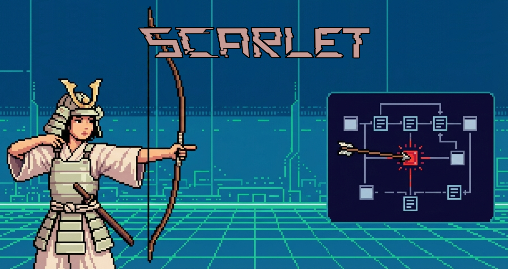
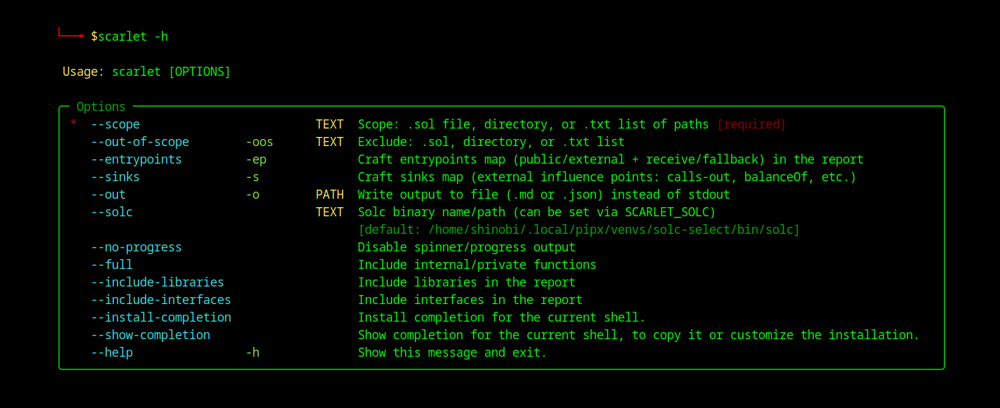

<h1 align='center'>SCARLET v0.1.0</h1>
<p align="center">
 <a href='#installation'>Installation</a> • <a href='https://github.com/Kode-n-Rolla/scarlet/blob/main/README.md#-basic-usage'>Usage</a> • <a href='https://github.com/Kode-n-Rolla/scarlet/blob/main/README.md#-roadmap'>Roadmap</a>
</p>

<p align="center">
  
</p>


---

<b>S</b>olidity <b>C</b>ontract <b>A</b>nalyzer & <b>R</b>esearch <b>L</b>ayer for <b>E</b>xecution & <b>T</b>ransfer

A CLI-based Web3 audit assistant designed for structural reconnaissance of Solidity protocols.

It helps auditors quickly map:
- attack surface
- external execution vectors
- value transfer paths
- external dependency influence

SCARLET optimizes for audit velocity, not automated vulnerability detection.

## 🎯 Intended Audience

- Smart contract auditors
- Security researchers
- Web3 protocol reviewers
- Bug bounty hunters
- Solidity engineers performing internal reviews

## 📦 Architecture
<b>Tech Stack</b>
- Python 3.11
- Typer (CLI layer)
- `solc` AST parsing (primary engine)
- Slither (fallback indexer)
- Markdown / JSON reporting

### Pipeline
```
CLI
 → Scope Resolver
 → solc AST
 → Slither fallback (if needed)
 → Indexer
 → Analyzers (entrypoints, sinks)
 → Renderer (MD / JSON)
```

<h2 id='installation'>🚀 Installation</h2>

### Requirements

- Python 3.10+
- `solc` (required for AST parsing)
- Slither (optional, fallback indexer)

### Install solc (recommended via solc-select)
```
solc-select install 0.8.24
solc-select use 0.8.24
solc --version
```
---

### Local Installation
```
git clone https://github.com/Kode-n-Rolla/scarlet.git
cd scarlet

python -m venv .venv
source .venv/bin/activate   # Windows: .venv\Scripts\activate

pip install -U pip
pip install -e ".[dev]"  # includes Slither fallback for MVP

scarlet --help
```
> `dev` extra currently includes Slither dependency required for fallback. Will be split into runtime extras soon

<p align="center">
  
</p>

## 🧠 Basic Usage
`scarlet --scope <path>`

### Examples
```
scarlet --scope scope.txt --out-of-scope out-of-scope.txt
scarlet --scope scope.txt --inlcude-libraries
scarlet --scope scope.txt --entrypoints
scarlet --scope src/ --sinks
scarlet --scope . -ep -o report.md
scarlet --scope . -s --out report.json
```

## ✅ Implemented Features
### 1️⃣ Scope System

`--scope` accepts:
- single `.sol` file
- directory (recursive)
- `.txt` list of paths

`--out-of-scope` / `-oos` accepts:
- `.sol`
- directory
- `.txt` list

✔ Deterministic scope resolution

✔ Clean subtraction logic

✔ Works with Foundry projects

✔ Auto-excludes `lib/`, `test/`, `script/` (if Foundry detected)

### 2️⃣ Output System
```
-o report.md
-o report.json
```

✔ Extension determines format (.md / .json)

✔ Clean Markdown for audit notes

✔ JSON for automation / pipelines

### 3️⃣ Contract Filtering

By default:
- Only `contract` types are included

Optional flags:
```
--include-libraries
--include-interfaces
```

## 🔥 Entrypoints Analyzer
`--entrypoints` / `-ep`

### Purpose

Expose the protocol attack surface.

<b>Includes</b>
- `public`
- `external`
- `receive()`
- `fallback()`

<b>Behavior</b>

✔ Filters out inherited functions declared in other files (MVP behavior)

✔ Libraries & interfaces excluded by default

✔ Inline access-control detection:

- modifier-based guards
- `require(msg.sender == X)` style checks

<b>Tags</b>
- for-all
- guarded
- guarded-inline
- value
- admin-ish
- calls-out
- delegatecall

### Philosophy

Entrypoints are triage signals.

They indicate externally reachable execution paths.
They are <b>not vulnerability confirmations</b>.

## 🧨 Sinks Analyzer
`--sinks` / `-s`

<b>Purpose</b>

Highlight external influence points inside function bodies.

<b>Detects</b>

✔ Low-level calls:
- `.call`
- `.delegatecall`
- `.staticcall`

✔ Delegatecall execution surfaces

✔ External dependency reads:
- `balanceOf(...)`
- `balanceOf(address(this))`

<b>Why This Matters</b>

`balanceOf(address(this))` can be influenced by:
- direct token donation
- fee-on-transfer tokens
- rebasing tokens
- flash-loan balance inflation

Low-level calls indicate:
- potential reentrancy vectors
- control-flow injection
- upgrade surface risks


> ⚠ SCARLET does not perform full vulnerability detection.
> 
> It maps execution influence points to accelerate manual review.


## 📄 Markdown Report

✔ Automatic Table of Contents

✔ Stable anchor IDs

✔ Deterministic ordering

✔ Contract type visible

✔ Visibility + mutability shown

✔ Tags displayed under each function

Reports are optimized for:
- fast manual scanning
- audit note copy-paste
- diff comparison between runs

## ⚠ Disclaimer

SCARLET is a structural audit assistant.

It does not guarantee vulnerability detection and does not replace manual security review.

It is designed to accelerate reconnaissance and reduce cognitive load during early-stage protocol analysis.


## ⚠ Compiler Version (Pragma) Note

SCARLET uses `solc` AST parsing.

If contract contains strict pragma:
```
pragma solidity 0.8.24;
```

and your system `solc` version differs, you may see:
```
ParserError: Source file requires different compiler version
```

### 🔧 Fix Compiler Version Mismatch

Using `solc-select`:
```
solc-select install 0.8.24
solc-select use 0.8.24
solc --version
```

Then:
```
scarlet --scope . --sinks
```

Or explicitly:
```
scarlet --scope . --sinks --solc /path/to/solc-0.8.24
```

Environment variable:
```
SCARLET_SOLC=/path/to/solc
```

### ⚠ Note:

>Slither fallback does not support `--sinks` mode yet
(sinks rely on precise AST source slicing).
>
>Slither offsets may be less precise than solc AST.

## 🎯 Design Philosophy

SCARLET is a <b>structural reconnaissance tool</b>.

> Think:
> **"Attack surface mapper"**
> not
> **"Automated vulnerability scanner"**

It reduces cognitive load during early-stage protocol review.

## 🛣 Roadmap

### 🔹 Phase 1 — Stabilization
- Improve heuristic coverage
- Expand inline guard detection
- Improve Slither offset precision
- Large-scale testing on production protocols

👉 MVP complete. Active testing on real-world audit targets.

### 🔹 Phase 2 — Call Graph Engine

Planned flag:
```
--callgraph
```

Capabilities:
- Internal function call graph
- External interaction graph
- Delegatecall propagation mapping
- DOT (Graphviz) export
- JSON export
- Markdown summary

<b>Goal</b>:

Visualize execution paths and privilege escalation surfaces.

### 🔹 Phase 3 — Mock Generator (Audit Helpers)

Planned flags:
```
--generate-mock <file>
--generate-mock --template ERC20
```

<b>Purpose</b>:

Generate test harness contracts for fuzzing and simulation.

<b>Planned templates</b>

- ERC20 (standard)
- ERC20 fee-on-transfer
- ERC20 rebasing
- ERC20 deflationary
- ERC721 minimal
- ERC4626 vault
- Upgradeable proxy mock
- Malicious callback receiver

<b>Goal</b>:

Accelerate Foundry / Echidna fuzz harness setup.
### 🔹 Phase 4 — Advanced Influence Mapping
- State-write detection
- Cross-function storage mutation map
- Privilege surface visualization
- External dependency matrix
